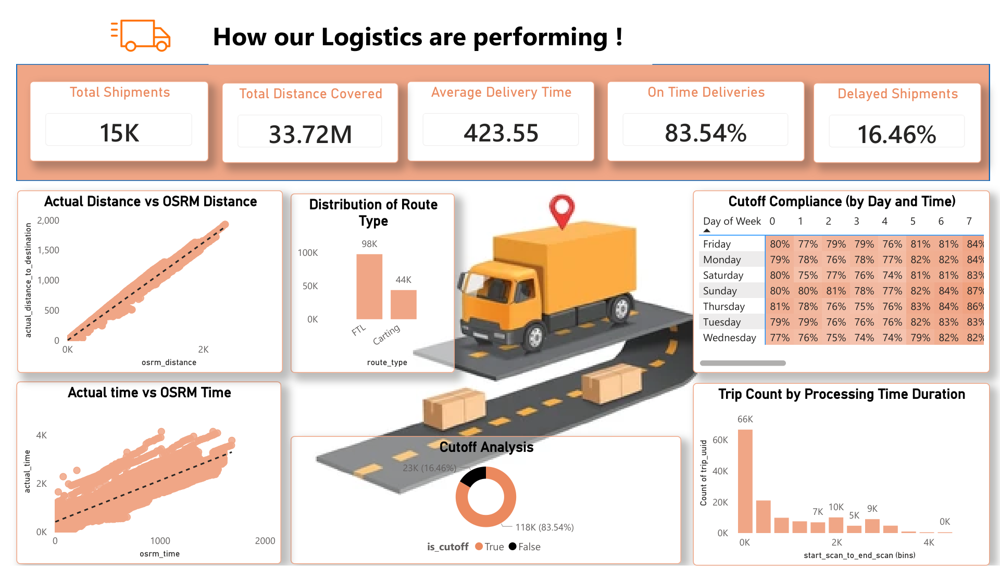

# Logistics Performance Analysis

## Overview
This project provides a comprehensive analysis of logistics performance, focusing on shipment delivery times, distances, and compliance. The analysis is based on data from various routes and delivery types, providing insights into operational efficiency and areas for improvement.

## Dashboard

## Key Metrics
- **Total Shipments**: 15K (Dashboard display) / ~141K (Aggregated data)
- **Total Distance Covered**: 33.72M
- **Average Delivery Time**: 423.55
- **On-Time Deliveries**: 83.54%
- **Delayed Shipments**: 16.46%

## Detailed Analysis

### Cutoff Compliance
The analysis includes a detailed breakdown of cutoff compliance by day of the week and time. Sunday shows the highest compliance rates, peaking at 87%.

### Route Type Distribution
- **FTL (Full Truck Load)**: 98K shipments/trips
- **Carting**: 44K shipments/trips

### Actual vs. OSRM Analysis
A comparison between actual delivery metrics and OSRM (Open Source Routing Machine) predictions shows:
- **Time Comparison**: Actual delivery times generally align with OSRM predictions but show variability in certain routes.
- **Distance Comparison**: High correlation between actual distance and OSRM distance, ensuring routing accuracy.

### Processing Time
The "Trip Count by Processing Time Duration" chart highlights the distribution of time taken from the start scan to the end scan, with a significant concentration in the lower duration bins.

---
*For more details, please refer to the [Logistics Performance Analysis.pdf](Logistics%20Performance%20Analysis.pdf).*
